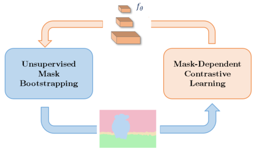

# CYBORGS

This repository contains the source code for our paper:

[CYBORGS: Contrastively Bootstrapping Object Representations by Grounding in Segmentation](https://arxiv.org/abs/2203.09343)  
ECCV 2022  
Renhao Wang, Hang Zhao, Yang Gao  



# Requirements

## Code

Tested on Ubuntu 18.04 with CUDA 11.3. We include an environment file for fast setup. We also borrow heavily from the VirTex code base, which can be installed [as per their docs.](https://kdexd.xyz/virtex/virtex/usage/setup_dependencies.html)

```
# Example environment setup
conda env create -f cyborgs.yaml
conda activate cyborgs
pip install torch==1.10.0+cu113 torchaudio==0.10.0+cu113 torchvision==0.11.1+cu113 -f https://download.pytorch.org/whl/torch_stable.html
git clone https://www.github.com/kdexd/virtex
pip install -r virtex/requirements.txt
pip install git+git://github.com/facebookresearch/fvcore.git#egg=fvcore
pip install git+git://github.com/cocodataset/cocoapi.git#subdirectory=PythonAPI
cd virtex
python setup.py develop
```

## Data

All datasets follow the setup and structure delineated in the [VirTex code base](https://kdexd.xyz/virtex/virtex/usage/setup_dependencies.html#setup-datasets).


# Demos

Download a [pretrained CYBORGS checkpoint](https://www.dropbox.com/s/semga9bzqe9zol8/cyborgs_frozen_800.pth?dl=0) and place the weights under `/path/to/virtex/ckpts/cyborgs`. Our downstream finetuning follows [Detectron2-like configs](https://github.com/kdexd/virtex/tree/master/configs) provided in the VirTex code base. For example, to reproduce our results from the paper on PASCAL VOC 2007+2012 object detection:

```
cd /path/to/virtex
python scripts/eval_detectron2.py \
    --config ckpts/cyborgs/pretrain_config.yaml \
    --d2-config configs/detectron2/voc_det_default_init_24k.yaml \
    --checkpoint-path ckpts/cyborgs/cyborgs_frozen_800.pth \
    --weight-init torchvision \
    --num-gpus-per-machine 8 \
    --cpu-workers 2 \
    --serialization-dir ckpts/cyborgs/voc_det_500000 \
    --checkpoint-every 25000
```

For more details, kindly refer to [the docs](https://kdexd.xyz/virtex/virtex/usage/downstream.html).


# Training

To perform CYBORGS pretraining with the default (best) settings:

```
python main_cyborgs.py \
    --dist_url 'tcp://localhost:10020' \
    --num_gpus_per_machine 8 \
    --data_dir /path/to/coco \
    --mask_dir /path/to/bootstrapped/masks \
    --epochs 800 \
    --warmup_epoch 10 \
    --lr_scheduler step \
    --lr_decay_rate 0.1 \
    --lr_decay_epochs 768 784 \
    --batch_size 16 \
    --num_classes 81 \
    --min_clusters 2 \
    --max_clusters 256 \
    --boot_freq 100 \
    --num_workers 16 \
    --layer_name layer2.2 \
    --imgs_per_batch 16 \
    --num_proc 48 \
    --output_dir save/detcon_boot_100
```


# Evaluation


The following downstream evaluation tasks use the [VirTex code base](https://kdexd.xyz/virtex/virtex/usage/downstream.html) as well:

- [PASCAL VOC 2007 Linear Classification](https://kdexd.xyz/virtex/virtex/usage/downstream.html#pascal-voc-2007-linear-classification)
- [PASCAL VOC 2007+2012 Object Detection](https://kdexd.xyz/virtex/virtex/usage/downstream.html#object-detection-on-pascal-voc-2007-12)
- [ImageNet Linear Classification](https://kdexd.xyz/virtex/virtex/usage/downstream.html#imagenet-linear-classification)
- [COCO Instance Segmentation](https://kdexd.xyz/virtex/virtex/usage/downstream.html#instance-segmentation-and-object-detection-on-coco)


# Acknowledgements

This work is all about bootstrapping self-supervised representations, and our contributions are very much bootstrapped (in a self-supervised way!) from a wonderful community of open source resources. We owe a great debt of gratitude to [Karan Desai](http://kdexd.xyz/) for his wonderfully written repository VirTex, and also to [Olivier Henaff](https://www.olivierhenaff.com/) and his co-authors for [DetCon](https://github.com/deepmind/detcon), which heavily inspired the core self-supervised learning component of our algorithm.


# Citation

If you find our work or code helpful, please consider citing us:

```
@inproceedings{wang2022cyborgs,
  title={CYBORGS: Contrastively Bootstrapping Object Representations by Grounding in Segmentation},
  author={Wang, Renhao and Zhao, Hang and Gao, Yang},
  booktitle={European conference on computer vision},
  year={2022}
}
```

